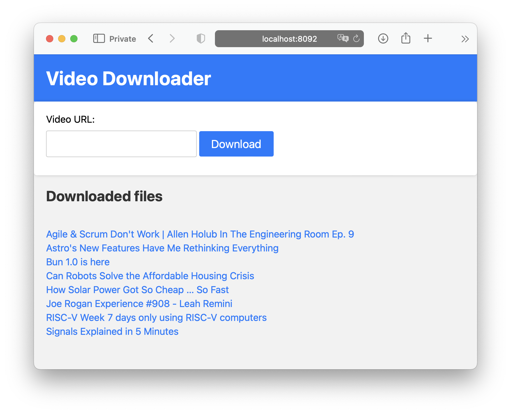

# yt
Simple, self-hosted web-based video downloader using the popular tool *wink wink*.



It attempts to download h264 videos from the popular online video sites so they're readily available to play using any browser without any conversion and workarounds.

## Configuration

The application stores downloaded videos in a directory defined by the
`VIDEOS_DIR` environment variable. By default this is `videos/` relative to the
project root. When running via Docker Compose the folder is mounted into both
the Flask container and Nginx so the files can be served directly. Set this
variable before running the app to customize where downloads are stored:

```bash
export VIDEOS_DIR=/path/to/videos
python -m app
```

## Running locally

Install the dependencies and launch the development server:

```bash
pip install -r app/requirements.txt
python -m app
```

## Tests

Basic tests for the helper functions can be executed with `pytest`:

```bash
pytest
```

These tests cover utilities such as safe filename generation to ensure filenames
remain cross platform friendly and easily URL encoded.
